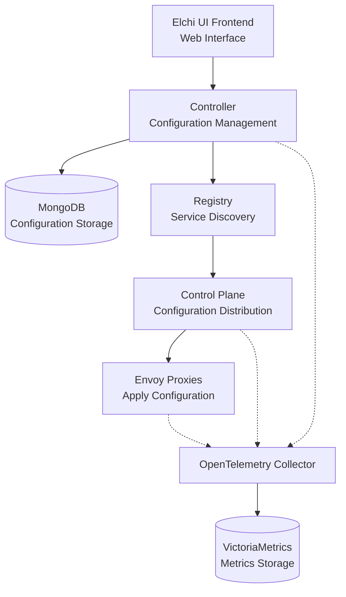

[](https://artifacthub.io/packages/search?repo=elchi-stack)

# Elchi Proxy Management Platform - Helm Charts

This repository contains Helm charts for deploying the **Elchi** - a comprehensive proxy management platform that provides UI-based configuration management for Envoy proxies.

## 🚀 What is Elchi?

Elchi is a proxy management platform that simplifies Envoy proxy configuration through a web-based interface:

- **UI Frontend**: Web interface for creating and managing proxy configurations
- **Controller**: Receives configurations from UI and stores them in MongoDB
- **Control Plane**: Distributes configuration snapshots to Envoy proxies
- **Registry**: Handles routing and service discovery between components

## Available Versions
> Syntax: `<elchiBackendVersion>`-`<goControlPlaneVersion>`-`<envoyVersion>`

- `v0.1.0-v0.13.4-envoy1.34.2`
- `v0.1.0-v0.13.4-envoy1.33.5`

## Global Values

| Parameter | Description | Default |
|-----------|-------------|---------|
| `global.namespace` | Namespace where all components will be deployed | `"elchi-stack"` |
| `global.mainAddress` | Base URL for all components | `""` (Required) |
| `global.port` | Port for the Elchi controller API. If empty, uses 80/443 based on TLS | `""` |
| `global.tlsEnabled` | Whether to use HTTPS | `false` |
| `global.installMongo` | Whether to use self-hosted MongoDB | `true` |
| `global.installVictoriaMetrics` | Whether to use self-hosted Victoria Metrics | `true` |
| `global.internalCommunication` | Enable internal communication between services | `false` |
| `global.versions` | List of Elchi backend versions to deploy | `[v0.1.0-v0.13.4-envoy1.33.5, v0.1.0-v0.13.4-envoy1.34.2]` |
| `global.mongodb.hosts` | MongoDB connection hosts (comma-separated for replica set) | `""` |
| `global.mongodb.username` | MongoDB username | `"elchi"` |
| `global.mongodb.password` | MongoDB password | `"elchi"` |
| `global.mongodb.database` | MongoDB database name | `"elchi"` |
| `global.mongodb.scheme` | Connection scheme (mongodb or mongodb+srv) | `""` |
| `global.mongodb.port` | MongoDB connection port | `""` |
| `global.mongodb.replicaset` | Replica set name (if using replica set) | `""` |
| `global.mongodb.timeoutMs` | Connection timeout in milliseconds | `""` |
| `global.mongodb.tlsEnabled` | Enable TLS connection to MongoDB | `""` |
| `global.mongodb.authSource` | Authentication source database (e.g., admin) | `""` |
| `global.mongodb.authMechanism` | Authentication mechanism | `""` |
| `global.victoriametrics.endpoint` | External Victoria Metrics endpoint (required when installVictoriaMetrics is false). Supports both `http://host:port` and `host:port` formats | `""` |
| `global.elchiBackend.controlPlaneDefaultReplicas` | Default replicas for Control Plane services | `2` |
| `global.elchiBackend.controllerDefaultReplicas` | Default replicas for Controller services | `2` |

## ElchiBackend Chart Values

| Parameter | Description | Default |
|-----------|-------------|---------|
| `image.repository` | Elchi backend image repository | `"jhonbrownn/elchi-backend"` |
| `image.pullPolicy` | Image pull policy | `"Always"` |
| `resources.controller.requests.memory` | Controller service memory request | `"255Mi"` |
| `resources.controller.requests.cpu` | Controller service CPU request | `"150m"` |
| `resources.controller.limits.memory` | Controller service memory limit | `"512Mi"` |
| `resources.controller.limits.cpu` | Controller service CPU limit | `"250m"` |
| `resources.controlPlane.requests.memory` | Control Plane service memory request | `"256Mi"` |
| `resources.controlPlane.requests.cpu` | Control Plane service CPU request | `"150m"` |
| `resources.controlPlane.limits.memory` | Control Plane service memory limit | `"512Mi"` |
| `resources.controlPlane.limits.cpu` | Control Plane service CPU limit | `"250m"` |
| `resources.registry.requests.memory` | Registry service memory request | `"256Mi"` |
| `resources.registry.requests.cpu` | Registry service CPU request | `"150m"` |
| `resources.registry.limits.memory` | Registry service memory limit | `"512Mi"` |
| `resources.registry.limits.cpu` | Registry service CPU limit | `"250m"` |
| `service.type` | Kubernetes service type | `"ClusterIP"` |
| `service.controller.port` | Controller REST service port | `8099` |
| `service.controller.grpcPort` | Controller gRPC service port | `50051` |
| `service.controlPlane.port` | Control Plane service port | `18000` |
| `service.registry.port` | Registry service port | `9090` |
| `config.logging.level` | Logging level | `"info"` |
| `config.logging.formatter` | Log formatter type | `"text"` |
| `config.logging.reportCaller` | Whether to report caller in logs | `"false"` |

## Elchi Chart Values

| Parameter | Description | Default |
|-----------|-------------|---------|
| `replicas` | Number of Elchi replicas | `3` |
| `image.repository` | Elchi image repository | `"jhonbrownn/elchi"` |
| `image.tag` | Elchi image tag | `"v0.1.0"` |
| `image.pullPolicy` | Image pull policy | `"Always"` |
| `service.type` | Kubernetes service type | `"ClusterIP"` |
| `service.port` | Service port | `80` |
| `resources.requests.memory` | Memory request | `"255Mi"` |
| `resources.requests.cpu` | CPU request | `"200m"` |
| `resources.limits.memory` | Memory limit | `"512Mi"` |
| `resources.limits.cpu` | CPU limit | `"300m"` |

## Envoy Chart Values

| Parameter | Description | Default |
|-----------|-------------|---------|
| `replicas` | Number of Envoy replicas | `4` |
| `image.repository` | Envoy image repository | `"envoyproxy/envoy"` |
| `image.tag` | Envoy image tag | `"v1.33.0"` |
| `image.pullPolicy` | Image pull policy | `"Always"` |
| `service.type` | Kubernetes service type | `"NodePort"` |
| `service.httpPort` | HTTP service port | `8080` |
| `service.adminPort` | Admin service port | `9901` |
| `resources.requests.memory` | Memory request | `"128Mi"` |
| `resources.requests.cpu` | CPU request | `"100m"` |
| `resources.limits.memory` | Memory limit | `"256Mi"` |
| `resources.limits.cpu` | CPU limit | `"200m"` |

## MongoDB Chart Values

| Parameter | Description | Default |
|-----------|-------------|---------|
| `replicaCount` | Number of MongoDB replicas | `1` |
| `image.repository` | MongoDB image repository | `"mongo"` |
| `image.tag` | MongoDB image tag | `"6.0.12"` |
| `image.pullPolicy` | Image pull policy | `"IfNotPresent"` |
| `persistence.enabled` | Enable persistence | `true` |
| `persistence.size` | PVC size | `"3Gi"` |
| `persistence.storageClass` | PVC storage class | `"standard"` |
| `service.type` | Kubernetes service type | `"ClusterIP"` |
| `service.port` | Service port | `27017` |
| `resources.requests.memory` | Memory request | `"256Mi"` |
| `resources.requests.cpu` | CPU request | `"250m"` |
| `resources.limits.memory` | Memory limit | `"512Mi"` |
| `resources.limits.cpu` | CPU limit | `"500m"` |

## Victoria Metrics Chart Values

| Parameter | Description | Default |
|-----------|-------------|---------|
| `image.repository` | Victoria Metrics image repository | `"victoriametrics/victoria-metrics"` |
| `image.tag` | Victoria Metrics image tag | `"v1.93.5"` |
| `image.pullPolicy` | Image pull policy | `"IfNotPresent"` |
| `service.type` | Kubernetes service type | `"ClusterIP"` |
| `service.port` | Service port | `8428` |
| `storage.size` | Storage size for metrics data | `"10Gi"` |
| `storage.storageClass` | Storage class | `"standard"` |
| `retentionPeriod` | Data retention period | `"30d"` |
| `resources.requests.memory` | Memory request | `"256Mi"` |
| `resources.requests.cpu` | CPU request | `"100m"` |
| `resources.limits.memory` | Memory limit | `"512Mi"` |
| `resources.limits.cpu` | CPU limit | `"200m"` |

## OpenTelemetry Collector Chart Values

| Parameter | Description | Default |
|-----------|-------------|---------|
| `image.repository` | OTEL Collector image repository | `"otel/opentelemetry-collector-contrib"` |
| `image.tag` | OTEL Collector image tag | `"0.89.0"` |
| `image.pullPolicy` | Image pull policy | `"IfNotPresent"` |
| `service.type` | Kubernetes service type | `"ClusterIP"` |
| `service.grpcPort` | gRPC service port | `4317` |
| `service.httpPort` | HTTP service port | `4318` |
| `resources.requests.memory` | Memory request | `"256Mi"` |
| `resources.requests.cpu` | CPU request | `"100m"` |
| `resources.limits.memory` | Memory limit | `"512Mi"` |
| `resources.limits.cpu` | CPU limit | `"200m"` |

## Usage

### Installation

```bash
helm install my-elchi-stack elchi-stack/elchi-stack --version 0.1.0
```

### Configuration Examples

#### 1. Default Installation (with self-hosted MongoDB and Victoria Metrics)

```yaml
global:
  namespace: "elchi-stack"
  mainAddress: "your-domain.com"
  port: ""
  tlsEnabled: false
  installMongo: true
  installVictoriaMetrics: true
  versions:
    - tag: v0.1.0-v0.13.4-envoy1.34.2
    - tag: v0.1.0-v0.13.4-envoy1.33.5
  elchiBackend:
    controlPlaneDefaultReplicas: 2
    controllerDefaultReplicas: 2
```

#### 2. External MongoDB Configuration

```yaml
global:
  namespace: "elchi-stack"
  mainAddress: "your-domain.com"
  installMongo: false
  installVictoriaMetrics: true
  mongodb:
    hosts: "mongodb.example.com:27017"
    username: "elchi"
    password: "elchi"
    database: "elchi"
    scheme: "mongodb"
    tlsEnabled: "true"
    authSource: "admin"
    authMechanism: "SCRAM-SHA-256"
```

#### 3. External Victoria Metrics Configuration

```yaml
global:
  namespace: "elchi-stack"
  mainAddress: "your-domain.com"
  installMongo: true
  installVictoriaMetrics: false
  victoriametrics:
    endpoint: "http://victoria-metrics.example.com:8428"  # or "victoria-metrics.example.com:8428"
```

#### 4. Both External MongoDB and Victoria Metrics

```yaml
global:
  namespace: "elchi-stack"
  mainAddress: "your-domain.com"
  installMongo: false
  installVictoriaMetrics: false
  mongodb:
    hosts: "mongodb.example.com:27017"
    username: "elchi"
    password: "elchi"
    database: "elchi"
  victoriametrics:
    endpoint: "victoria-metrics.example.com:8428"  # or "http://victoria-metrics.example.com:8428"
```

### Install/Upgrade Commands

With values file:
```bash
helm install -f values.yaml my-elchi-stack elchi-stack/elchi-stack
# or
helm upgrade -f values.yaml my-elchi-stack elchi-stack/elchi-stack
```

With command line parameters:
```bash
helm install my-elchi-stack elchi-stack/elchi-stack \
  --version 1.0.0 \
  --set-string global.mainAddress="elchi.example.com" \
  --set-string global.port="23456" \
  --set global.installVictoriaMetrics=false \
  --set-string global.victoriametrics.endpoint="external-vm.example.com:8428"
```

## 🏗️ Architecture



### Components:

- **🎨 Elchi UI**: React-based web interface for proxy configuration management
- **🎯 Controller**: Receives configurations from UI and validates/stores them in MongoDB
- **🕹️ Control Plane**: Distributes configuration snapshots to Envoy proxy instances
- **📡 Registry**: Handles service discovery and routing between components
- **🌐 Envoy Proxy**: Load balancer and proxy
- **🗄️ MongoDB**: Database for storing proxy configurations (optional - supports external)
- **📊 VictoriaMetrics**: Time-series database for metrics storage (optional - supports external)
- **📈 OpenTelemetry Collector**: Collects and forwards metrics to VictoriaMetrics

## Notes

- When `installMongo: false`, you must provide external MongoDB connection details via `global.mongodb.*` parameters
- When `installVictoriaMetrics: false`, you must provide external Victoria Metrics endpoint via `global.victoriametrics.endpoint`
- The system supports multiple backend versions for rolling updates and canary deployments
- Envoy automatically routes traffic based on version headers and load balancing policies
